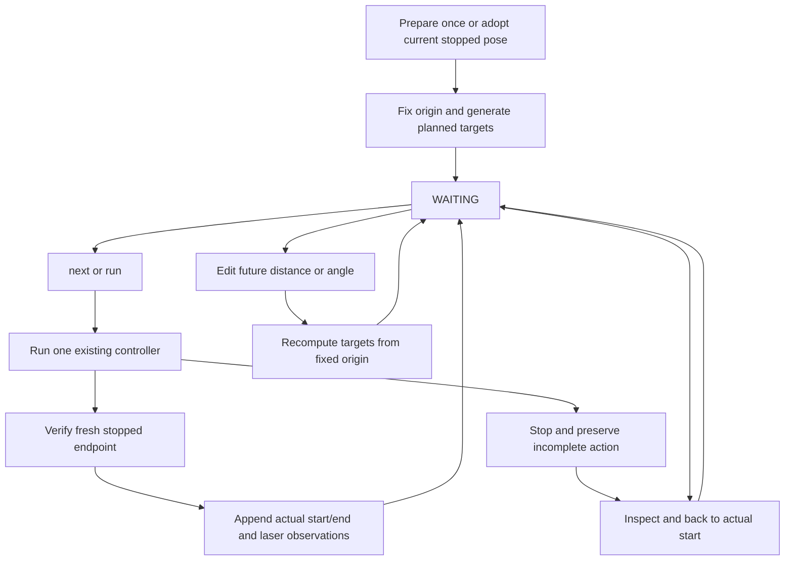

# One-origin action sessions

Use `action_session` to develop the measured Task6 route one action at a time.
Translations and in-place rotations are separate actions. The controller fixes
one origin after preparation and derives every target from the **previous planned
target**, not the actual stopping error. Actual poses remain feedback and return
anchors. The supplied route consolidates the manual survey; it is not yet a
verified continuous CyberWorld route or the official Task6 solver entry point.

For the distinct feedback-anchored wall route, use [wall-guided commissioning](wall_session.md).
Its targets advance from measured stops; the fixed-origin rules below describe the legacy route.

## Start and operate

Build both `distance_controller` and `turn_controller` in the ROS workspace.
Stop other velocity publishers before starting the session.

```bash
# Preview only; no motion or controller is started.
ros2 run distance_controller action_session

# At physical A: align to the wall, center, set rear distance once, then WAITING.
ros2 run distance_controller action_session --start prepare

# Alternatively, explicitly adopt an already prepared, stopped starting pose.
ros2 run distance_controller action_session --start current
```

Preparation logs report alignment and centering only. The paused controller does not print
its default Task2 waypoint table. After handoff, `Origin fixed` and the action plan
show the session targets, followed by `route>`.

The interactive prompt accepts:

| Command | Effect |
| --- | --- |
| `plan` | Show actions and regenerated target x/y/yaw |
| `next` | Execute one action, verify stopped endpoint, then wait |
| `run` | Execute remaining actions after typing RUN; still settles at each endpoint |
| `status` | Show next index, incomplete state and fresh stopped actual pose |
| `history` | Show active completed records and any incomplete action |
| `back` | After path confirmation, return to the last action's actual starting pose |
| `set 4 0.50` | Set translation action 4 to 0.50 m and recompute future targets |
| `set 3 -85` | Set turn action 3 to -85 degrees and recompute future targets |
| `load route.json` | Replace future actions; completed prefix must remain unchanged |
| `save route.json` | Export current action definitions, not resumable robot state |
| `measure` | Read/save front, left, right and rear sensor ranges without moving |
| `quit` | End this session and its in-memory return history |

Press **Ctrl+C during motion** to stop the owned controller and latch an incomplete
action. Inspect the robot and use `back` only if the return path is clear and
feedback remains valid. `next`, `run` and edits cannot skip an incomplete action.
The journal keeps both failed attempts and successful returns. A return command
moves to a recorded pose rather than negating the commanded distance. No automatic
recovery from a collision, stuck robot, changed odom frame, or reset is attempted.

Example: after a right-translation trial finishes too far right, use `back`,
confirm BACK, change that action with `set INDEX DISTANCE`, then `next`. The
returned action becomes editable again; previous history is not rewritten.
Future points shift according to the revised distance/angle. Corrections are
tracked by plan revision. Plan targets remain anchored to the original origin.

## Starting a reverse experiment at P15

```bash
ros2 run distance_controller action_session --reverse
ros2 run distance_controller action_session --reverse --start current
```

This uses inverse action order from the provided route definitions, starting at
P15 **after its final left 180-degree turn**. The first action undoes that turn
clockwise, then the next action backs toward P14. It is a new experiment, not an
exact restoration of old actual poses. Default route distances are consolidated
commands; turn slip, odom drift and multiple small-stop tolerances require site
review. Never use `--start prepare` at the endpoint. In contrast, `back` in a live
session uses actual recorded starts. The older `survey_return` helper remains a
standalone single-step tool; it does not share edits/history with this session.

## Files and units

`config/task6_actions.json` stores unique action names, direction and explicit
units (`m`, `deg`, or `rad`). Internal calculations use meters/radians. Use a copied
file with `--route FILE` for custom actions. Append new actions using `load` while
waiting. Turn angles are signed: positive left, negative right. Turn commands
change planned yaw only; translation commands change x/y while holding planned
yaw. Small lateral/heading corrections inside the existing position controller
remain enabled; nominal forward motion is not a guarantee of zero lateral output.

| File | Responsibility |
| --- | --- |
| `tools/action_plan.py` | Pure target generation, edits, active history and incomplete/retry rules |
| `tools/action_runtime.py` | Fresh odom, controller process ownership, absolute targets and stops |
| `tools/action_session.py` | CLI commands, route I/O and append-only journal |
| `tools/survey_distances.py` | Four-direction scan observation with TF and freshness checks |



## Runtime boundaries

- One same-process odom epoch only. JSONL is an audit, not automatic resume state.
- Endpoints must be within 0.03 m and 0.02 rad of the requested target after the
  underlying controller reports completion. Its own normal tolerances still apply.
- Waiting relocation over 0.03 m or 0.05 rad rejects motion. Timestamp/frame changes
  or large per-message odom jumps latch an error. These checks cannot detect every
  possible reference reset; do not reset/relocalize odom during a session.
- Translations send absolute odom targets and opt into `adopt_planned_heading`.
  Its default is false, preserving existing entry points. A mismatch above 0.10 rad
  is rejected; large rotations must be separate actions. Turn targets use continuous
  yaw so direction is preserved across +/-pi.
- A completed rotation can have position drift. Position error is checked, but the
  turn controller does not actively restore x/y. Large drift requires inspection.
- Front/rear/left/right snapshots are recorded before/after actions. They are sensor
  ray ranges, not body clearance; they do not control motion or guarantee avoidance.
- Only one command publisher/controller may run. Losing this helper or its host
  still requires the previously verified base command watchdog.

A timestamped `action_session_*.jsonl` in the working directory records origin,
plan revisions, requested/actual poses, completion errors, partial attempts,
returns and laser snapshots. Finalized `completed` events are never rewritten.

## Local verification and remaining gate

Pure tests cover target propagation, stopping error separation, executed-edit
rejection, return/retry, interrupted return, origin changes, explicit units and
inverse routes. The synthetic ROS fixture drives the actual controller executables
through move/turn/back/edit/retry and Ctrl+C interruption. These are local checks,
not proof that the merged 21-action real maze route is collision-free. Validate it
with `next` at each step before using `run`; Task6 has no acceptance tag yet.

```bash
python3 test/test_action_plan.py
python3 test/test_survey_return.py
# Source ROS Humble and the workspace. The fixture sets localhost/domain179.
python3 test/verify_action_session.py
```

For a blocked, unstarted wall-guided turn, `adjust_turn 0.02` requests one fixed
2 cm right correction. See [clearance adjustment](wall_session.md#explicit-clearance-adjustment-before-a-blocked-turn).
It remains stopped for a separate `resume` and persists through checkpoints.
